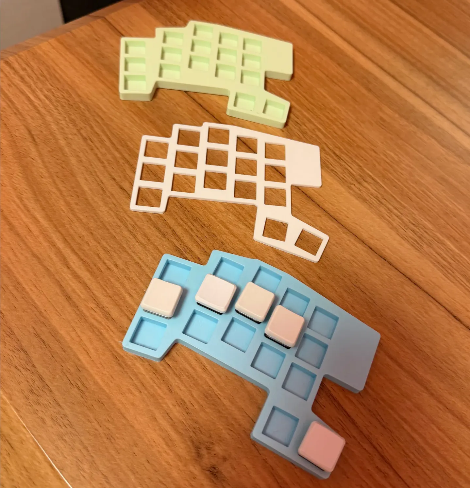

# The moltening

Almost two months ago, [Christoph Nakazwa](https://github.com/cpojer) introduced me to
~~Clawdbot~~ ~~Moltbot~~ OpenClaw.

I was told it was the first _useful_ AI assistant. That it was finally the approach that
made LLMs useful outside of coding and basic information retrieval.

So I tried to install it.

Three hours later I wondered which hell spawn wrote the doc and why it said it ran on
Linux when all the onboarding and skills were geared towards MacOS and were hard to run
in Docker or in an LXC. I also wondered why there were _so many options_ for everything
when half of them didn't work properly or were bad fits.

But I did get it to run after much fiddling and debugging. I was talking to my clanker
over discord, and it had access to a shell in a container.

# The good

And it did not disappoint, honestly. Giving an LLM a _full_ UNIX environment to solve
problems is a game changer.

Over the past 40 years, many nerds, myself included, championned CLI-first workflows for
writing and checking code, debugging, analyzing data, reading emails, sending
messages... And that's just a perfect fit for an LLM-based agent.

By reducing the number of tools and focusing on the CLI, with skills used for
instructions, ClawdBot performed extremely well.

I used it to automate checking many RSS feeds and report interesting articles and
releases to me. I used it to help me file my taxes in Japan, creating a python script
that gets the JPY/EUR exchange rate on the days of trades to make sure I pay my fair
share of taxes.

Then I used it to design a keyboard. You see, I love
[ergogen](https://docs.ergogen.xyz/) for how it allowed many people, including me, to
design clean beautiful ergonomic keyboards.

But let's be honest: the doc is bad, the logic is iffy, and working with 1000 lines TOML
files should be classified as torture under the Geneva convention.

Thanks to ClawdBot, I was able to chat through discord to:

- Set up a new keyboard repo
- Iterate on keys placement based on my good old
  [Tolkeeb](https://github.com/mrtolkien/tolkeeb)
- Export PCBs to SVG so I could have visual validation
- Validate the changes through Github PRs
- Export the PCB shape to .stl so I could 3d print it

I got ClawdBot to design a new keyboard from scratch, up to generating 3d prototypes I
just had to print to validate the physical layout. All without ever touching my
terminal. Ngl, I was impressed.

# The meh

But it was not all moonlight and roses. The memory system was meh at best.

Any domain-specific question ended up triggering tons of web searches and fetches, and
knowledge was lost little by little with each compaction.

For ergogen in particular, I had to ask it to check the docs pretty much every time, or
it would make shit up.

And then, I had an epiphany: what if I made it build its own memory system, with
embeddings and atomic notes?

Great idea, I thought. I'm a moron, it seems.

Letting this clanker write complex code to modify its own behaviour was a class 1
catastrophe.

It ended up failing over and over, writing heaps on terrible code over terrible code. It
wasn't even lipstick on a pig, it was just pigs stacking up.

I also burned through 100$ of credit in 3 hours, which made my boss a bit angry since I
was using an API key I had lying around at my job: not a great idea if you want to keep
your job.

Then since it had changed name and the doc talked about a new binary name everywhere, I
also tried migrating to Moltbot. After 3 hours, I gave up and deleted my LXC to make a
new one.

By the time I had re-setup Moltbot, it had changed name to OpenClaw.

And somehow the onboarding wizard had gotten worse and I couldn't get it to work well
with OpenRouter and Kimi 2.5.

# The path forward

So at that point, I had really liked the _concept_ of OpenClaw, but not the _execution_:

- I felt like it was a dependency hell in itself: it dependended on npm + node, brew,
  git, gh, and many CLI tools
  - It ended up installing random stuff for itself, checking if there were here over and
    over again... Its environment got messy _fast_
- I disliked how wasteful it was with tokens and prompts
  - For example, my daily cron job for news checking was "fetch those URLs and recap
    them". So it would end up needing to parse the prompts, create tool calls (flaky
    with many instructions), _then_ actually do the job it was spawned to make.
  - Likewise, it ended up burning through heaps of token trying to bruteforce features
    it couldn't lend well or reading the same doc over and over and over again
- Its doc was sprawling and messy, and some concepts made no sense to me
  - Technically, it supports multi-users installs, but most users set it up for them
    only
  - As features got added, the doc got harder and harder to navigate, there were many
    duplicates, many outdated parts,... No bueno for a piece of software with as many
    moving pieces

The solution was clear to me:

- Rewrite it in Rust so it's single binary with no dependencies
- Include an opinionated knowledge system that focuses on creating high quality notes,
  like my Obsidian Vault
- Focus on token efficiency: heavy prompt engineering and testing, faster failures,
  autonomous agents with limited context to reduce variance, ...

# GHOST

So, that was four weeks ago. I iterated extremely fast with LLMs to get a PoC out of the
door, realized I made a lot of wrong assumptions, and started from scratch again.

I'm at the "why did I do this" step of software development. But I'll get it where I
want it to be. Give me a few weeks.

The project is called [`GHOST`](mhttps://github.com/mrtolkien/GHOST), in reference to
Ghost in the Shell. We're trying to make autonomous AI agents, that's pretty close to
creating the Puppet Master. Don't try to hack military systems with it though.

Here's where I'm at today:

- Single-user, single binary AI assistant
- Working through Discord + OpenRouter/OpenAI Codex
- Focused on extensibility through skills and CLI tools
- Can handle itself through its own CLI: no "get_history" tool but `ghost session logs`
- The `GHOST` is helped by focused agents
  - **Reflection**: Runs when a session becomes idle and distills information from web
    searches and fetches into well structured notes
  - **Deep research**: Handles web search and fetching, focusing on identifying high
    quality sources for the subject at hand
- The `GHOST` can access its notes and references through embedding queries, allowing it
  to use natural language to find relevant notes
- The notes build a directed knowledge graph based on markdown files, browsable through
  the CLI, powered by an embedded [SurrealDB](https://surrealdb.com/)

And here's the current state of the backlog:

1. Add a bulk import method to pull full documentation websites or codebases and query
   them through embeddings
2. Add a "Project" skill and workflow to let the assistant manage long horizon tasks,
   inspired by
   [Mitsuhiko's TODO](https://github.com/mitsuhiko/agent-stuff/blob/main/pi-extensions/todos.ts)
3. Add a coding agent inspired by pi-mono
4. Use [NixOS](https://nixos.org/) to manage the `GHOST`'s shell
5. Add more interfaces and providers
6. See if we need a dedicated browser tool like OpenClaw, using PlayWright to control a
   headless browser
7. Security pass, it's full YOLO so far
8. Doc + good onboarding flow + nice TUI for humans
9. Write down and test a few more e2e flows
10. Create a `GHOST` networking feature inspired by Moltbook, but useful instead of
    memey
11. Implement extensibility: allow the `GHOST` to create complex automated agents and
    workflows. Might be Typescript, might be Lua, might be Python, might just be
    markdown with frontmatter. We will see.

I'll start communicating more about it once the doc and onboarding flows are passable,
which should be in a week or two. I also expect to start using it to write its own code
once I get the coding agent in there.

[Repo here in case you want to give it a shot](https://github.com/mrtolkien/GHOST).
[DM me on Bluesky](https://bsky.app/profile/tolki.dev) if you want to give a hand or
have any suggestions!
